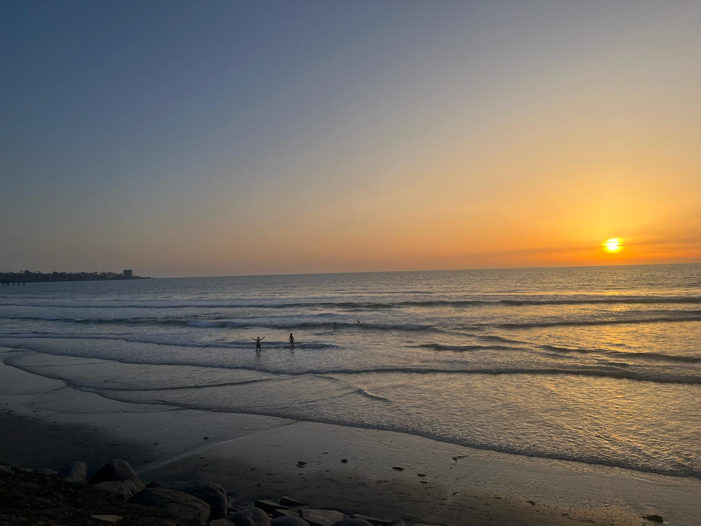
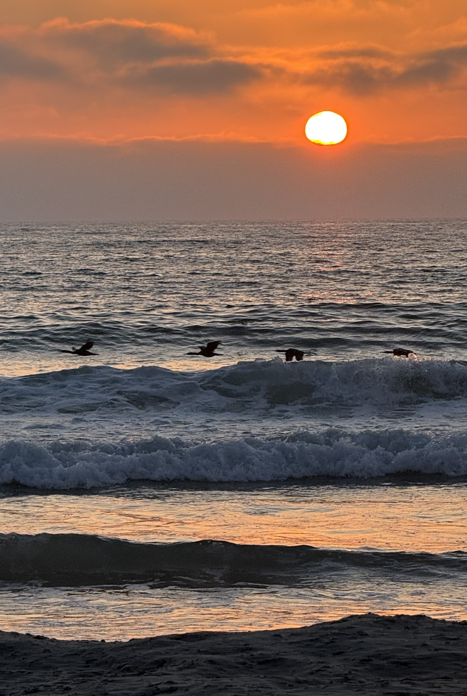
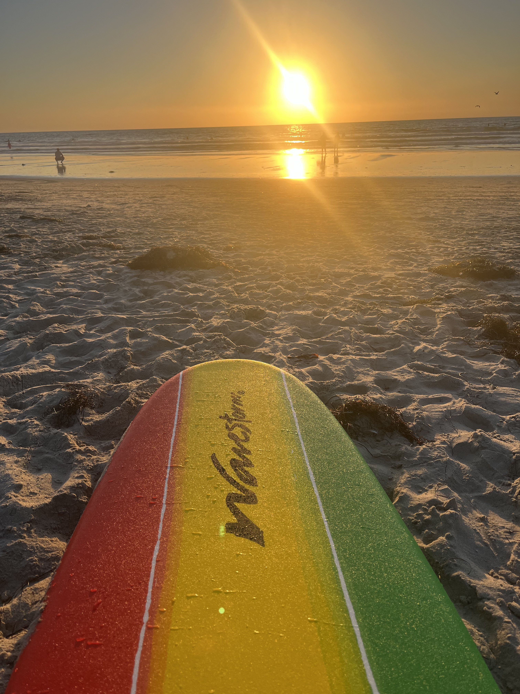
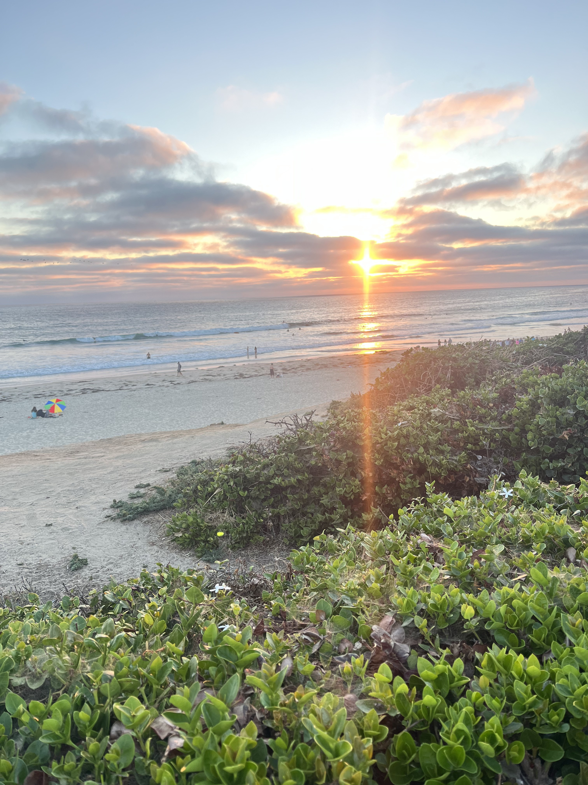
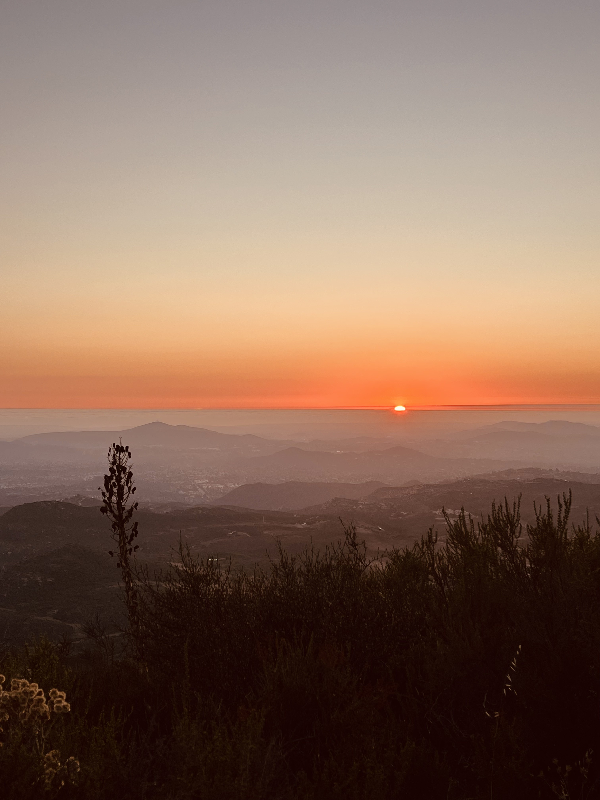
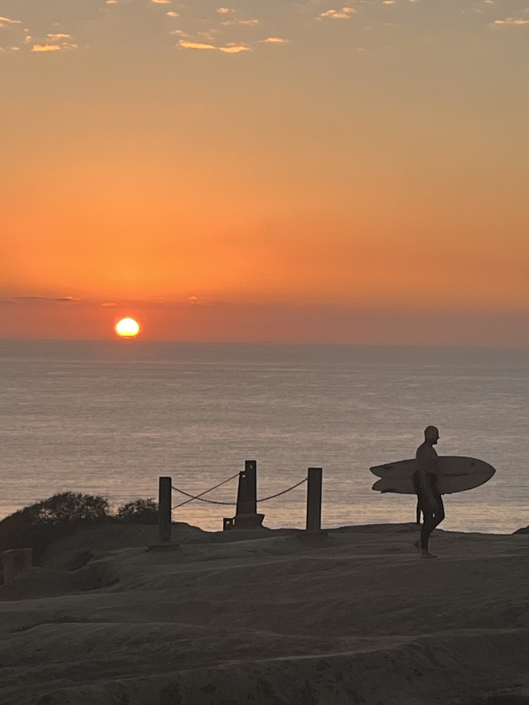
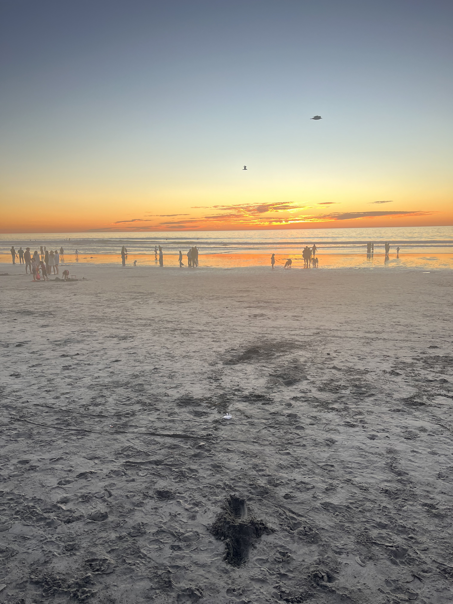
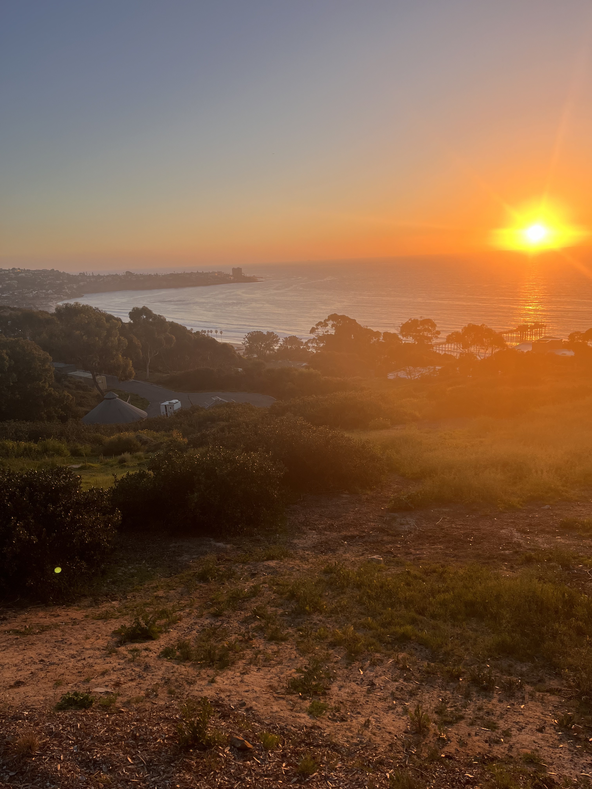
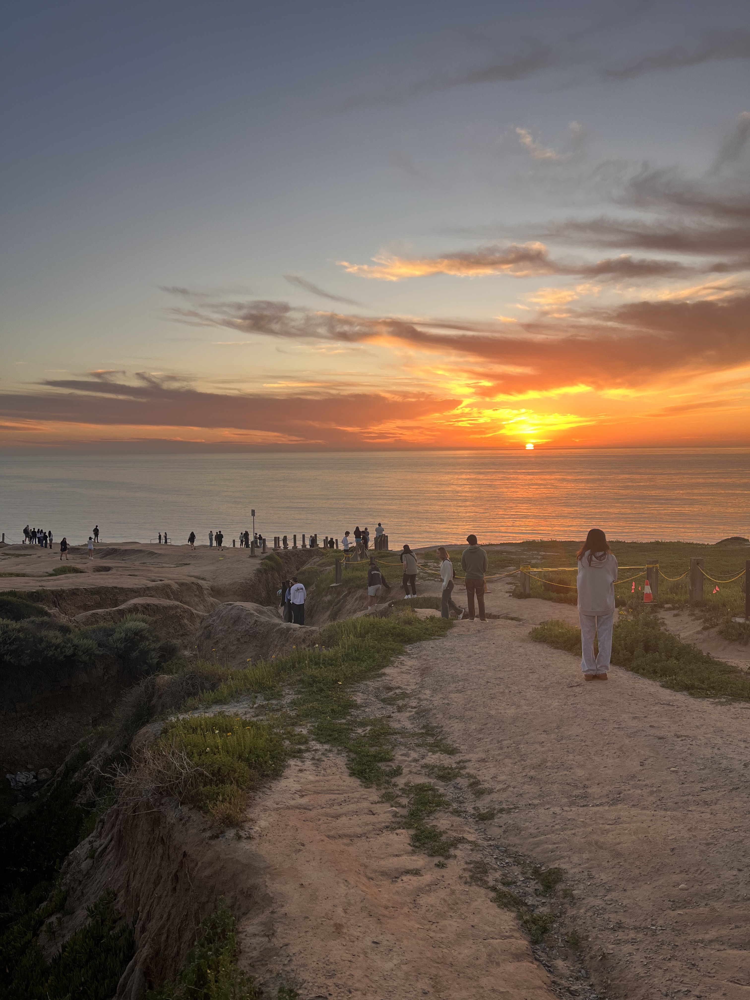
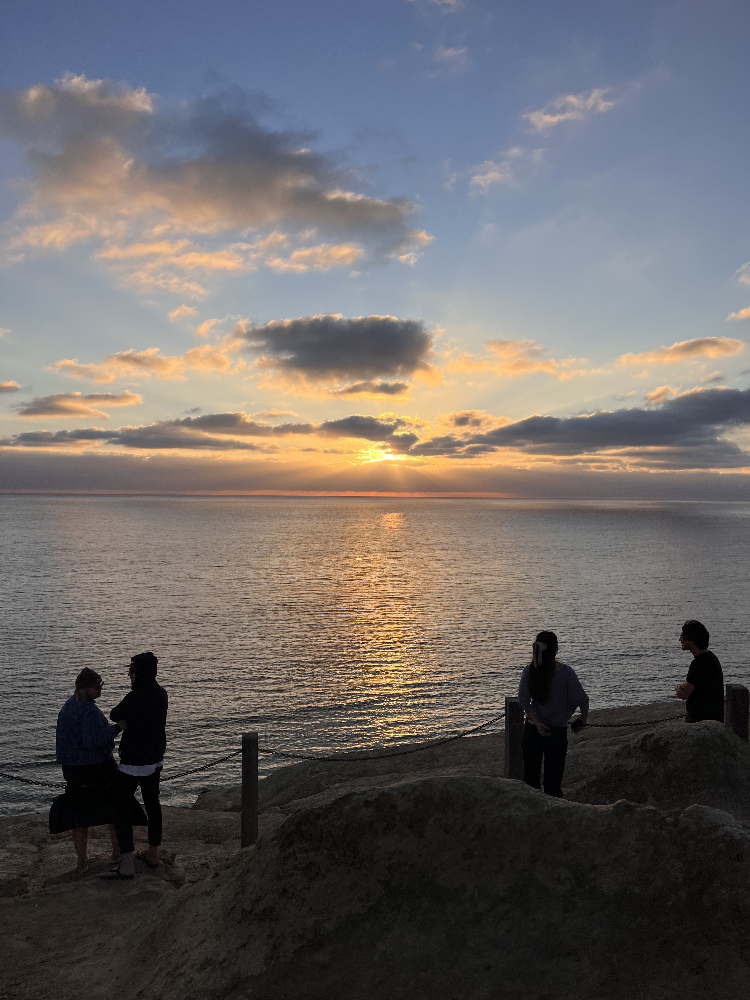

# California Sunsets

Here I keep a gallery of sunsets, most of them captured along the Southern California coastline in and around San Diego. Some of these evenings also coincide with my attempts to learn how to surf. While these photographs may not live up to high photographic standards, I enjoy capturing the diversity of sunsets and the different colors they create.

  

  

  

  

  

  

  

  

  

  

  

  

  

  
1 / 

  

    <button class="slide-btn" id="prev">&#8592; Prev</button>
    

    <button class="slide-btn" id="next">Next &#8594;</button>
  

