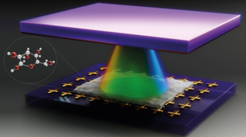
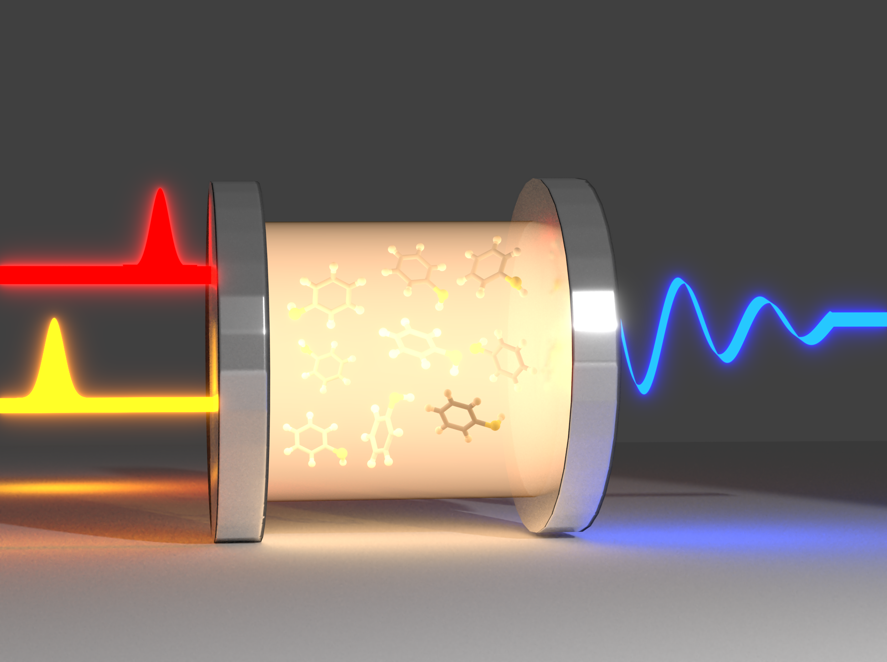
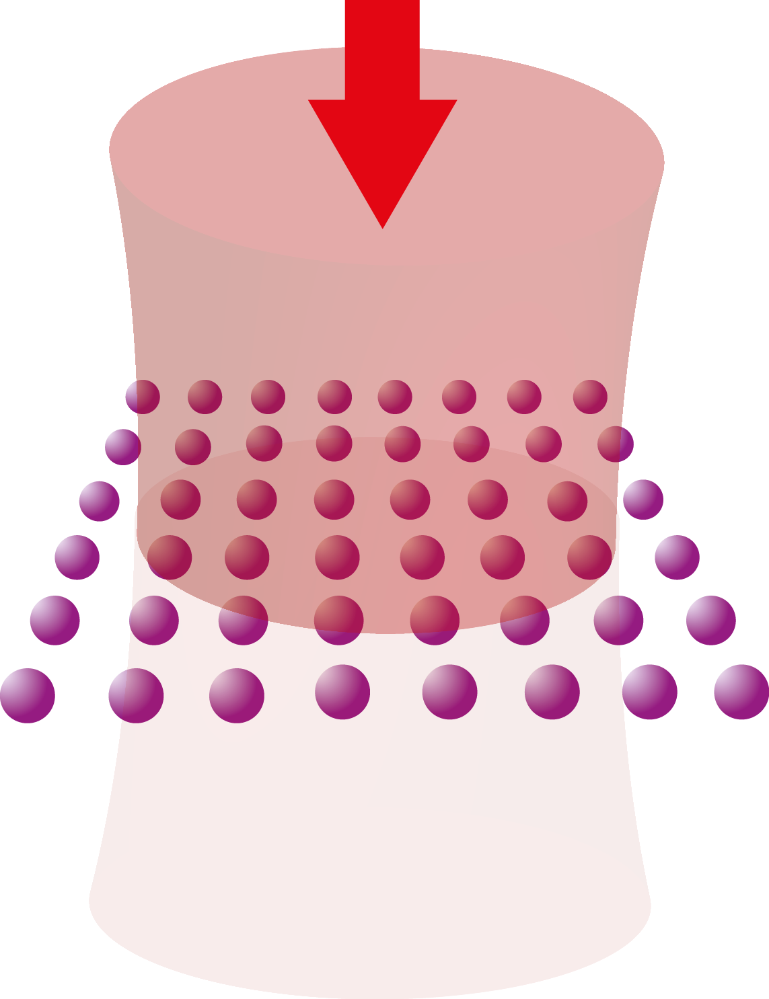
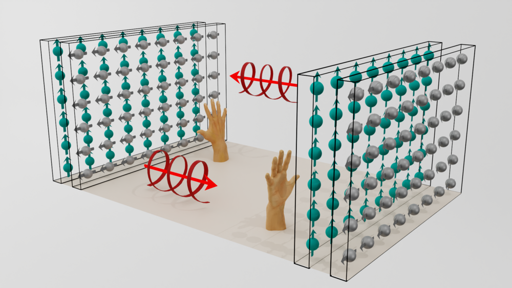

Hi! My name is Michael, and I am a postdoctoral researcher and theoretical physicist working on light-matter interactions (both quantum and classical regimes) in the group of [Joel Yuen-Zhou](https://yuenzhougroup.ucsd.edu/) at UC San Diego. I my research, I enjoy staying close to experiments and actively collaborating with experimentalists. I also like to work interdisciplinary and engaging with problems in chemistry or biology (such as, e.g., molecular chirality). 

You can learn more about my research below (under construction).

## Links

- [Google Scholar](https://scholar.google.com/citations?user=fWJToM8AAAAJ&hl=en)
- [arXiv](https://arxiv.org/search/?searchtype=author&query=Reitz%2C+M)

## Research (under construction)

### Strong light matter coupling

  

*Figure credit: Alexandra Genes, Genes design.*

**Selected publications:**
- [Nature Communications **15**, 48764 (2024)](https://www.nature.com/articles/s41467-024-48764-6)

---

### Ultrafast polariton spectroscopy

  

*Figure credit: Arghadip Koner.*

**Selected publications:**
- [Phys. Rev. Lett. **134**, 193803 (2025)](https://journals.aps.org/prl/abstract/10.1103/PhysRevLett.134.193803)
- [arXiv:2504.15501](https://arxiv.org/abs/2504.15501)

---

### Cooperative light scattering

  

**Selected publications:**
- [PRX Quantum **3**, 010201 (2022)](https://journals.aps.org/prxquantum/abstract/10.1103/PRXQuantum.3.010201)
- [Optics Express **31**, 6003 (2023)](https://opg.optica.org/oe/viewmedia.cfm?uri=oe-31-4-6003&html=true)

---

### Chiral sensing and resolution

  

*Figure credit: Alexandra Genes, Genes design.*

**Selected publications:**
- [Phys. Rev. Lett. **132**, 043602 (2024)](https://journals.aps.org/prl/abstract/10.1103/PhysRevLett.132.043602)
- [J. Am. Chem. Soc. **147**, 11502 (2025)](https://pubs.acs.org/doi/full/10.1021/jacs.5c11502)
