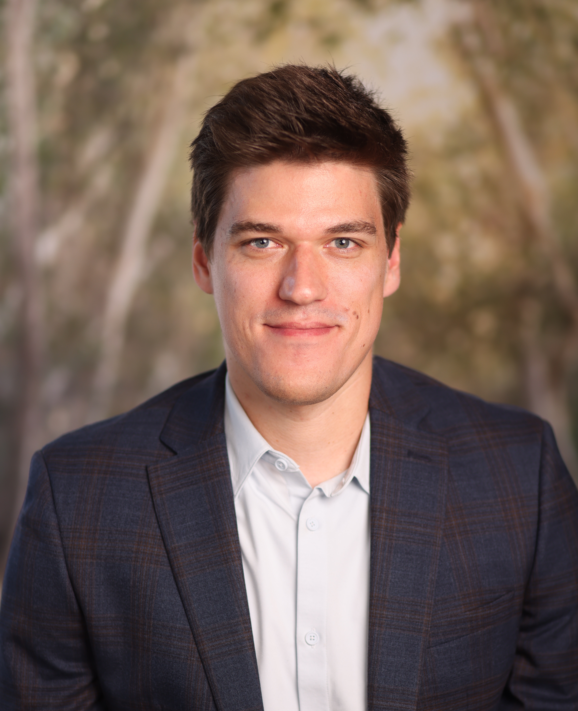

  

Hi! My name is Michael, and I am a postdoctoral researcher and theoretical physicist working on light-matter interactions in the group of [Joel Yuen-Zhou](https://yuenzhougroup.ucsd.edu/) at [UC San Diego](https://www.ucsd.edu/). Previously, I completed a PhD in the group of [Claudiu Genes](https://www.iap.tu-darmstadt.de/tqt/theoretical_quantum_technology/index.en.jsp) (now at TU Darmstadt) at the [Max Planck Institute for the Science of Light](https://mpl.mpg.de/) and [FAU Erlangen](https://www.fau.eu/) in Germany. 

Broadly speaking, my research aims to investigate and develop new theoretical tools and platforms for describing light–matter interactions in nanophotonic environments, while also maintaining close connections to potential applications. I my research, I enjoy staying close to experiments and actively collaborating with experimentalists. I also like to work interdisciplinary and engaging with problems in chemistry or biology (such as, e.g., molecular chirality, spin chemistry or photosynthetic light harvesting). 

You can learn more about my research on the [Research](research) page.

Feel free to reach out to me at **mireitz [at] ucsd [dot] edu**.

## Publications

Most of my publications can be found through the following links:

- [Google Scholar](https://scholar.google.com/citations?user=fWJToM8AAAAJ&hl=en)
- [arXiv](https://arxiv.org/search/?searchtype=author&query=Reitz%2C+M)
- [ChemRxiv (some works)](https://chemrxiv.org/engage/chemrxiv/search-dashboard?text=%22Michael%20Reitz%22)

