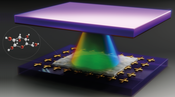
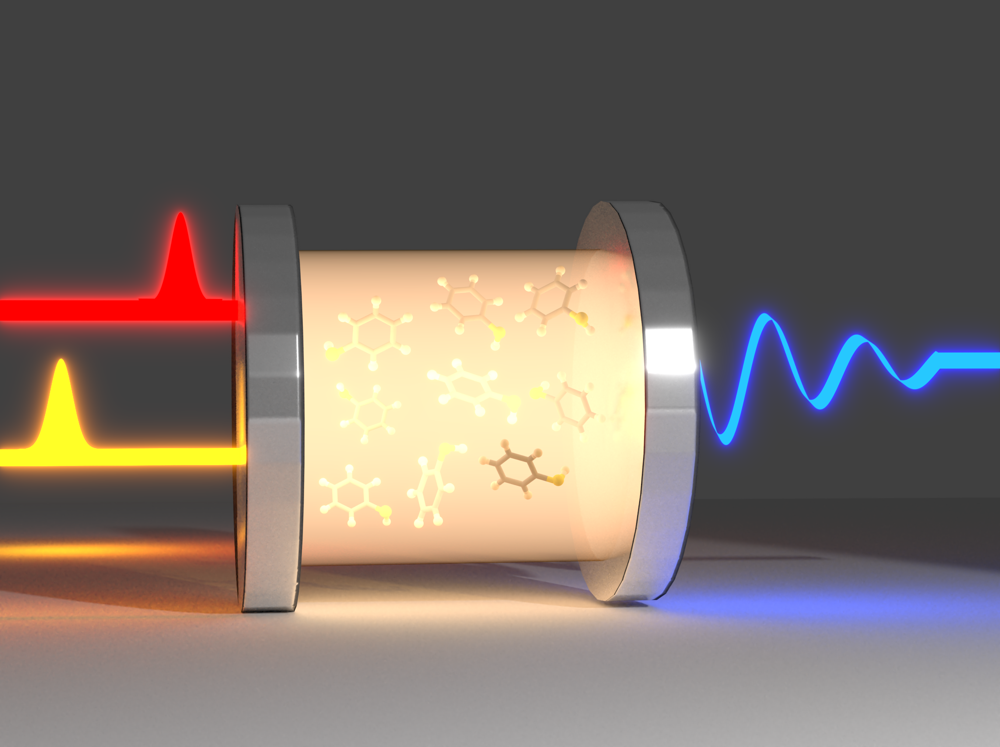
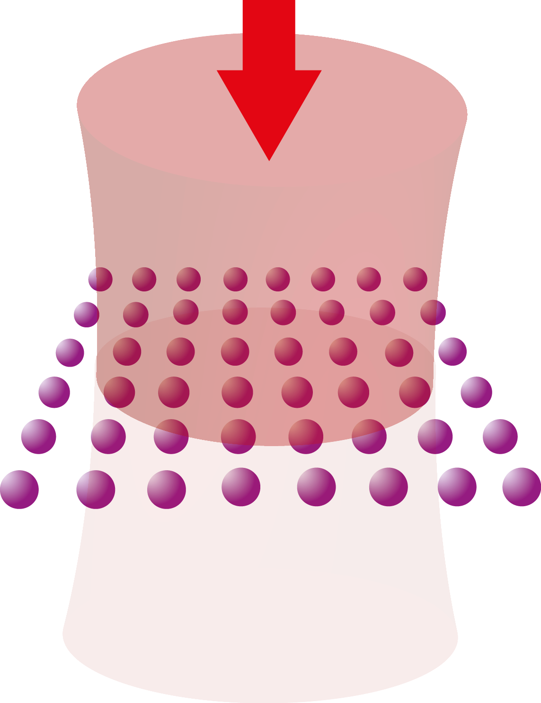
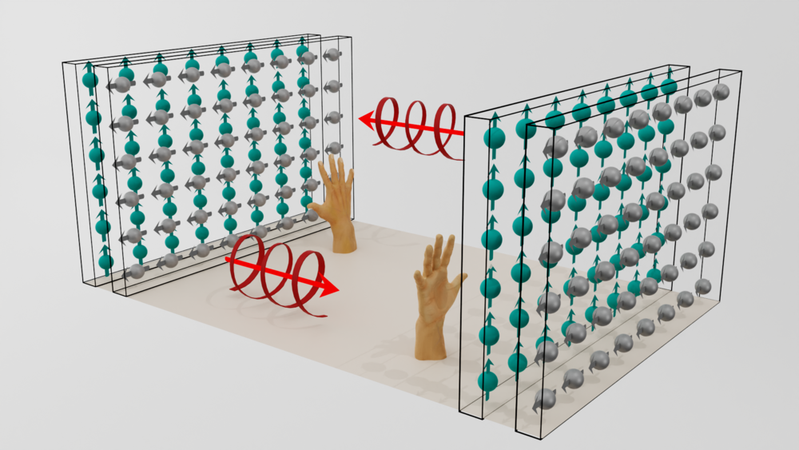

## Research 

(under construction)

### Strong light-matter coupling

  

*A terahertz cavity is formed by a mirror (top) interfaced with a metasurface (bottom), achieving strong light-matter coupling with glucose. Figure credit: Alexandra Genes, Genes design.*

**Selected publications:**
- [Nature Communications **15**, 48764 (2024)](https://www.nature.com/articles/s41467-024-48764-6)

---

### Ultrafast polariton spectroscopy

  

*Laser pulses are entering an optical cavity containing an ensemble of molecules. Figure credit: Arghadip Koner.*

**Selected publications:**
- [Phys. Rev. Lett. **134**, 193803 (2025)](https://journals.aps.org/prl/abstract/10.1103/PhysRevLett.134.193803)
- [Nano Lett. **26**, 19 (2026)](https://pubs.acs.org/doi/10.1021/acs.nanolett.6c00326)

---

### Cooperative light scattering in atomic arrays

  

*An array of atoms is illuminated by an incident light beam.*

**Selected publications:**
- [PRX Quantum **3**, 010201 (2022)](https://journals.aps.org/prxquantum/abstract/10.1103/PRXQuantum.3.010201)
- [Optics Express **31**, 6003 (2023)](https://opg.optica.org/oe/viewmedia.cfm?uri=oe-31-4-6003&html=true)

---

### Chiral sensing and resolution

  

*A helicity-preserving cavity formed by metasurface mirrors which can be used for the sensitive detection of chiral molecules. Figure credit: Alexandra Genes, Genes design.*

**Selected publications:**
- [Phys. Rev. Lett. **132**, 043602 (2024)](https://journals.aps.org/prl/abstract/10.1103/PhysRevLett.132.043602)
- [J. Am. Chem. Soc. **147**, 11502 (2025)](https://pubs.acs.org/doi/full/10.1021/jacs.5c11502)
